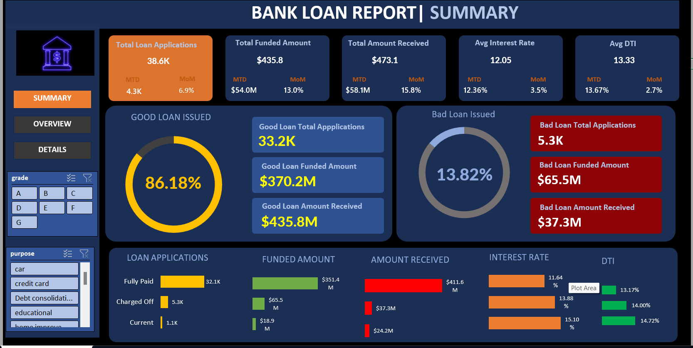

# Loan Analysis Dashboard 📊

## Project Overview
This project analyzes loan data using MS Excel to evaluate loan performance, repayment trends, and customer behavior.

## Tools & Technologies
- MS Excel
- Pivot Tables
- Pivot Charts
- Slicers

## Key Features
- Loan status analysis (Fully Paid, Current, Charged Off)
- Loan amount and customer-wise insights
- Interactive dashboard with slicers and charts

## Dashboard Preview

